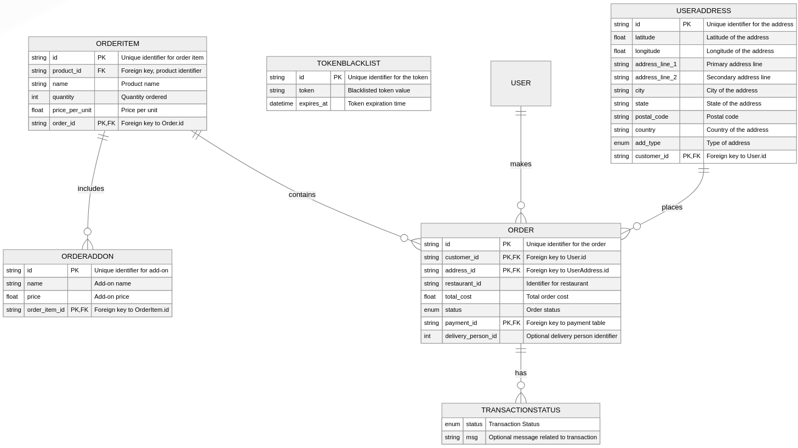

## 🍔 FoodieExpress - The Ultimate Food Delivery Platform 🚀

Welcome to FoodieExpress, a cutting-edge food delivery platform powered by a robust microservices architecture! This project combines various technologies to deliver delicious food to your doorstep with lightning-fast speed and precision. 🍕🍣🌮
## 🎯 Project Overview

FoodieExpress is a modern food delivery system where:

- 📱 Users can browse and order meals from their favorite restaurants.
- 🛵 Delivery partners ensure timely and efficient order delivery.
- 🍴 Restaurants can manage their menus and orders seamlessly.

With a scalable and flexible architecture, this project showcases the best of microservices and cloud-native technologies.

## 🛠️ Tech Stack
Core Technologies:
|Service|Technology Stack|
|---|---|
|🔐 Auth Service|FastAPI, OAuth2, JWT|
|🛒 Order Service|FastAPI, PostgreSQL|
|🍔 Menu Service|FastAPI, PostgreSQL|
|🛵 Delivery|Node.js, Express, PostgreSQL|

## ✨ Features
### For Users:

- 🧭 Explore Restaurants: Browse nearby restaurants with detailed menus.
- 🔥 Personalized Recommendations: Powered by AI and user behavior.
- 💳 Secure Payments: Multiple payment options with encryption.

### For Restaurants:

- 🍳 Menu Management: Easy updates and inventory tracking.
- 🕒 Real-Time Order Tracking: Monitor incoming orders.

### For Delivery Partners:

- 🗺️ Route Optimization: Powered by geospatial data.
- 📱 Mobile App: Accept and manage deliveries on the go.

## 🚀 Quick Start

```bash
git clone https://github.com/bytesByHarsh/food_delivery
cd food_delivery

# Run in VirtualENV - Python3.10
pip install -r requirement.txt
```

```bash
cd customer_service
python app/main.py
```

```bash
cd restaurant_api
python app/main.py
```

```bash
cd driver_service
npm install
npm install cors
node src/index.js
```

## Customer Microservice - [Link](customer_service/README.md)

- Python
- FastAPI
- PostgreSQL

